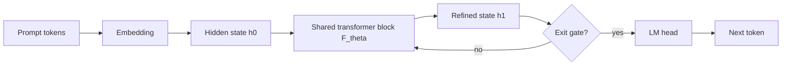

# 第 19 天：循环语言模型 - 用重复深度换取潜在推理

> **观看动画**：

## 一句话总结

循环语言模型会把同一个 transformer block 在潜在空间里反复执行多次，因此模型可以把更多内部计算预算留给困难 token，而不必线性增加参数量。

---

## 为什么这很重要

### 扩展推理能力不只靠“更大模型”

标准 transformer 的扩展路径通常是继续增加参数量或增加不同的层数：

- 更宽，能存更多知识
- 更深，能做更多计算步骤
- 更多 token，能见更多训练数据

这条路能走通，但三个维度都会一起变贵：

- 显存和内存占用上涨
- 训练成本上涨
- 即使是简单 token，推理时也得付完整深度的计算成本

循环模型尝试的是另一种折中：

**尽量保持参数不变，但在真正需要时反复复用深度。**

### 这正是近期前沿的收敛方向

这个方向最近很热，不是因为某一篇孤立论文，而是因为几条工作正在朝同一个结论收敛：

- **Ouro** 表明小型循环 LM 在推理任务上可以逼近大得多的 dense baseline
- **LoopFormer** 研究了带 shortcut modulation 的弹性深度循环 transformer
- **Loop, Think, & Generalize** 进一步从 recurrent-depth 角度分析隐式推理，并指出循环既可能增强泛化，也可能带来 overthinking

所以这已经不只是“老 recurrent idea 复活”，而是在变成一条具体的 scaling 路线。

---

## 核心洞察

### 1. 推理可以发生在潜在空间里，而不只发生在输出 token 里

很多公开演示里的“长推理”都依赖生成更多可见 token，但计算并不一定非得发生在 token 序列上。

循环模型会在**隐藏状态内部**做额外工作：

1. 先读入 prompt
2. 在同一份表示上做多轮潜在更新
3. 等内部状态更稳定后再解码

这就是它的关键价值：模型可以在不暴露长链路思维文本的情况下，“想得更久”。

### 2. 共享权重让一个 block 变成多步有效深度

普通深层模型会把不同层 $L_1, L_2, L_3, \dots, L_N$ 依次用一次。循环模型则会把同一个 block $F_\theta$ 反复调用：

- 第 1 轮：粗略解析
- 第 2 轮：重组证据
- 第 3 轮：收紧答案
- 第 4 轮：如果还不确定，再继续推理

虽然权重共享，但隐藏状态每一轮都在变化，因此模型仍然在执行真正的多步计算。

### 3. 自适应退出让计算成本按 token 难度分配

更强的循环架构一般不会强迫每个 token 经过完全相同的循环次数。

这样就有了更合理的计算策略：

- 简单 token 提前退出
- 困难 token 保留更多循环次数
- 平均推理成本仍然可控

这让循环深度很像一种潜在空间里的 test-time compute scaling。

---

## 架构流程



### 它和普通深层 Transformer 的区别

- 不是把很多不同层堆起来，而是反复复用同一个 block
- 中间隐藏状态会把前几轮的计算结果带到下一轮
- 是否继续循环，可以按 token 难度动态决定，而不是写死固定深度

---

## 数学表述

### Recurrent Depth 更新

设 embedding 之后的初始状态为：

$$
h^{(0)} = \mathrm{Embed}(x)
$$

同一个共享 block 在第 $r$ 轮把状态更新成：

$$
h^{(r+1)} = F_\theta\left(h^{(r)}, x\right)
$$

其中：

- $x$ 是输入上下文
- $h^{(r)}$ 是第 $r$ 轮后的潜在状态
- $F_\theta$ 是每一轮都复用的共享 transformer block

### 自适应退出

退出头决定当前状态是否已经足够好，可以开始解码：

$$
e^{(r)} = \sigma\left(w^\top h^{(r)} + b\right)
$$

其中 $e^{(r)}$ 可以理解为“现在退出是否足够可靠”的概率。

总循环次数写成：

$$
R(x) = \min \{ r : e^{(r)} \ge \tau \}
$$

阈值 $\tau$ 控制模型退出得保守还是激进。

### 最终 token 分布

只有在最后一轮潜在更新之后，模型才做一次解码：

$$
p(y \mid x) = p_\phi\left(y \mid h^{(R(x))}\right)
$$

所以收益来自“在输出 token 之前多做内部计算”，而不是单纯生成更多可见推理 token。

### 为什么它会有效

一个有用的直觉是：

$$
\text{Reasoning Quality} \approx f(\text{knowledge}, \text{latent depth}, \text{decode quality})
$$

传统 scaling 主要推第一项，循环模型则试图直接增强中间这项，也就是潜在深度。

---

## Python 代码实现

```python
from dataclasses import dataclass
from typing import List


@dataclass
class TokenState:
    value: float
    uncertainty: float


class SharedReasoningBlock:
    """
    一个极简循环 block。
    每一轮都会降低不确定性，并把潜在状态往证据方向拉近。
    """

    def __init__(self, gain: float = 0.32, damping: float = 0.54) -> None:
        self.gain = gain
        self.damping = damping

    def step(self, state: TokenState, evidence: float) -> TokenState:
        refined_value = state.value + self.gain * (evidence - state.value)
        residual = abs(evidence - refined_value)
        refined_uncertainty = max(0.02, state.uncertainty * (self.damping + 0.45 * residual))
        return TokenState(refined_value, refined_uncertainty)


class LoopedDecoder:
    """
    反复复用同一个 block，直到 token 足够自信时退出。
    """

    def __init__(self, threshold: float = 0.14, max_loops: int = 6) -> None:
        self.threshold = threshold
        self.max_loops = max_loops
        self.block = SharedReasoningBlock()

    def run(self, evidence: float) -> tuple[TokenState, List[TokenState]]:
        state = TokenState(value=0.0, uncertainty=1.0)
        trace = [state]

        for _ in range(self.max_loops):
            state = self.block.step(state, evidence)
            trace.append(state)
            if state.uncertainty <= self.threshold:
                break

        return state, trace


if __name__ == "__main__":
    decoder = LoopedDecoder()

    for label, evidence in [("easy", 0.35), ("medium", 0.62), ("hard", 0.91)]:
        final_state, trace = decoder.run(evidence)
        print(
            f"{label}: loops={len(trace) - 1}, "
            f"value={final_state.value:.3f}, "
            f"uncertainty={final_state.uncertainty:.3f}"
        )
```

---

## 循环语言模型给我们的启发

1. **扩展推理能力，不一定要线性扩展参数量。**
2. **潜在空间里的计算，可以替代一部分 token 空间里的显式长链推理。**
3. **自适应退出是让 recurrent depth 变得实用的关键系统技巧。**
4. **循环次数不是越多越好，近期论文已经开始强调 overthinking 和稳定性问题。**
5. **这个方向把模型架构、test-time compute 和推理效率放进了同一个设计空间。**

---

## 相关教程

- [Day 04: 推理时计算扩展](/tutorials/zh/inference/04-test-time-compute.md)
- [Day 12: 基于置信度动态的提前停止](/tutorials/zh/inference/12-early-stopping.md)

---

## 参考资料

- [Scaling Latent Reasoning via Looped Language Models](https://arxiv.org/abs/2510.25741) - ByteDance Seed, 2025-10-29
- [Hugging Face Papers: Scaling Latent Reasoning via Looped Language Models](https://huggingface.co/papers/2510.25741)
- [LoopFormer: Elastic-Depth Looped Transformers for Latent Reasoning via Shortcut Modulation](https://huggingface.co/papers/2602.11451) - 2026-02-11
- [Loop, Think, & Generalize: Implicit Reasoning in Recurrent-Depth Transformers](https://arxiv.org/abs/2604.07822) - 2026-04-10
- [r/LocalLLaMA 讨论：Another dim of scaling? ByteDance drops Ouro](https://www.reddit.com/r/LocalLLaMA/comments/1okguct/another_dim_of_scaling_bytedance_drops_ouro_14b/)
