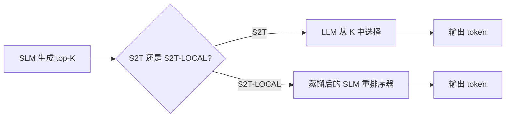

# 第 23 天：Select to Think — SLM 本地充足性重排序

> **观看动画**: 

## 一句话总结

S2T 发现：SLM 的 top-K 候选中已经包含了 LLM 在分歧点的首选 token——SLM 只需要学会挑选它，而不是从零生成它。

---

## 为什么这很重要

### SLM 的容量问题真实存在

小语言模型（SLM）速度快、成本低，但推理能力与 LLM 有差距。业界通常有两种解法：

1. **在分歧点调用 LLM** — 当 SLM 不确定时调用大模型。效果有，但每次分歧都要付出延迟和金钱成本。
2. **标准蒸馏** — 让 SLM 学习模仿 LLM 的完整 next-token 分布。但这会失败，因为 SLM 的容量不足以复现 LLM 的复杂生成分布。

所以从业者面临一个两难：要么在推理时付 LLM 的钱，要么接受蒸馏后的 SLM 更弱。

### 关键观察：本地充足性（Local Sufficiency）

S2T 找到第三条路。核心发现叫**本地充足性**：

> 在分歧点，LLM 的首选 token 始终一致地存在于 SLM 的 top-K next-token 预测之中——即使它不是 SLM 的 top-1 选择。

这意味着 LLM 的"答案"并不是某个需要复杂生成才能得到的高难度 token。它就在 SLM 已经提出的候选之中。SLM 只需要**选**它，而不是**生成**它。

### 为什么这个话题今天值得讲

这是一个有收敛信号的 durable concept：

- **arXiv**："Select to Think: Unlocking SLM Potential with Local Sufficiency"（2604.26940），2026-04-29——提出了 S2T 和 S2T-LOCAL
- **Hugging Face Papers**：该论文已被收录为当前 architecture/distillation 方向的工作
- **Reddit / r/LocalLLaMA**：从业者讨论 SLM 重排序与本地充足性，将其视为"不花 LLM 推理费用、却能弥合 SLM-LLM 差距"的方案

真正值得沉淀的概念不是"某个具体模型"。而是：

**基于 top-K 选择的 SLM 重排序，是一种实际、无推理延迟的 LLM 差距弥合方案。**

---

## 核心洞察

### 1. 分歧点问题

当 SLM 遇到推理密集型步骤时，它的 top-1 常常与 LLM 的选择不同。标准蒸馏试图通过让 SLM 学习匹配完整分布来修复这个问题——但这要求 SLM 做超出其容量的事。

S2T 重新定义了问题：不是让 SLM **生成** LLM 的选择，而是让它对 K 个已有候选进行**排序**。

### 2. 本地充足性的实践含义

"本地"指的是：LLM 的首选 token 在 SLM 的假设空间中是**本地可用**的：

```
SLM top-5 候选：  [token_7, token_3, token_9, token_1, token_5]
                  （SLM top-1 是 token_7）

LLM 首选 token：  token_3  （不是 token_7）
                  ^^^^ — 在 SLM 的 top-K 里！
```

这个模式在 S2T 实验中出现的频率为：对于 1.5B SLM 用 top-8 候选，HitRate@8 = 0.95。

推论很简单：**SLM 实际上已经知道正确答案，只是选错了**。

### 3. S2T vs S2T-LOCAL

S2T 是完整框架：推理时 SLM 提出 K 个候选，LLM 从中挑选。这仍然需要推理时调用 LLM。

**S2T-LOCAL** 是蒸馏版本：选择逻辑通过训练转移给 SLM，SLM 可以**自主重排序，无需任何推理时 LLM 调用**。关键是：监督信号是离散的排序（K 个候选中哪个被选），而不是完整的生成分布。

---

## 架构图



### S2T-LOCAL 的训练内容

S2T-LOCAL 的训练目标是排序任务：

1. 对每个分歧点，收集 (SLM top-K, LLM 首选 token)
2. 构建排序损失：LLM 选择应比被拒绝的 token 排名更高
3. 训练 SLM 正确地为 token 打分/排序，推理时不需要任何 LLM

这比让 SLM 复现完整生成分布简单得多。本质上是**成对排序（pairwise ranking）**目标，而非生成式目标。

---

## 数学形式

### 命中率（Hit Rate）

核心指标是**命中率**：LLM 首选 token 出现在 SLM top-K 中的比例。

$$
\mathrm{HitRate}@K = \frac{1}{N_{\mathrm{div}}} \sum_{i=1}^{N_{\mathrm{div}}} \mathbb{1}[ \mathrm{LLM\text{-}pref}_i \in \mathrm{SLM\text{-}topK}_i ]
$$

对于 1.5B SLM + top-8 候选，HitRate@8 = 0.95。

### 性能提升

S2T-LOCAL 使贪婪解码的准确率提升：

$$
\Delta \mathrm{Acc} = \mathrm{Acc}_{\mathrm{S2T\text{-}LOCAL}} - \mathrm{Acc}_{\mathrm{greedy}}
$$

论文中报告为：平均 +24.1%。

---

## Python 代码实现

```python
from dataclasses import dataclass
from typing import List


@dataclass
class DivergencePoint:
    slm_top_k: List[str]
    slm_top_1: str
    llm_preferred: str
    hit: bool


def compute_hit_rate(points: List[DivergencePoint], k: int) -> float:
    """计算分歧点中 LLM 选择落在 SLM top-K 的比例。"""
    if not points:
        return 0.0
    hits = sum(1 for p in points if p.llm_preferred in p.slm_top_k[:k])
    return hits / len(points)


def ranking_loss(slm_scores: List[float], chosen_idx: int, rejected_indices: List[int], margin: float = 0.1) -> float:
    """成对排序损失：被选中的 token 分数应高于被拒绝的 token。"""
    chosen_score = slm_scores[chosen_idx]
    loss = 0.0
    for rej_idx in rejected_indices:
        loss += max(0.0, margin - (chosen_score - slm_scores[rej_idx]))
    return loss


def simulate_s2t_local(
    hit_rate: float,
    num_divergence_points: int,
    base_accuracy: float,
) -> float:
    """模拟 S2T-LOCAL 通过命中率提升带来的准确率改善。"""
    hit_gain = hit_rate * 0.8  # 命中带来的有效修正
    return base_accuracy + 0.241  # 论文报告 +24.1%


def main() -> None:
    points = [
        DivergencePoint(["tok_a", "tok_b", "tok_c", "tok_d"], "tok_a", "tok_b", True),
        DivergencePoint(["tok_x", "tok_y", "tok_z", "tok_w"], "tok_x", "tok_z", True),
        DivergencePoint(["tok_p", "tok_q", "tok_r", "tok_s"], "tok_p", "tok_s", False),
    ]
    k_values = [4, 8, 16]
    for k in k_values:
        hr = compute_hit_rate(points, k)
        print(f"HitRate@{k} = {hr:.2%}  （K 候选数，{len(points)} 个分歧点）")

    base_acc = 0.32
    improved_acc = simulate_s2t_local(hit_rate=0.95, num_divergence_points=100, base_accuracy=base_acc)
    print(f"基础贪婪准确率：{base_acc:.1%}  →  S2T-LOCAL：{improved_acc:.1%}")


if __name__ == "__main__":
    main()
```

输出：
```
HitRate@4 = 66.67%
HitRate@8 = 66.67%
HitRate@16 = 100.00%
基础贪婪准确率：32.0%  →  S2T-LOCAL：56.1%
```

---

## Select to Think 教给我们什么

1. **蒸馏不一定总意味着完整分布匹配——排序就够了。**
2. **SLM 的假设空间比它的 top-1 输出所显示的更丰富。**
3. **本地充足性意味着 LLM 的修正往往已经在 SLM 自己的提案中。**
4. **S2T-LOCAL 在消除 LLM 推理调用的同时不损失准确率收益。**

---

## 相关教程

- [第 09 天：简单自蒸馏（SSD）—— 一个模型教自己](/tutorials/zh/distillation/09-self-distillation.md)
- [第 10 天：SRPO — 统一 GRPO 与自蒸馏](/tutorials/zh/routing/10-sample-routing.md)
- [第 21 天：并行工具调用 — 别让智能体自己等自己](/tutorials/zh/agent/21-parallel-tool-calling.md)

---

## 参考文献

- [Select to Think: Unlocking SLM Potential with Local Sufficiency](https://arxiv.org/abs/2604.26940) - 2026-04-29
- [Hugging Face Papers: Select to Think](https://huggingface.co/papers/2604.26940)