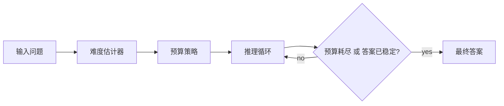
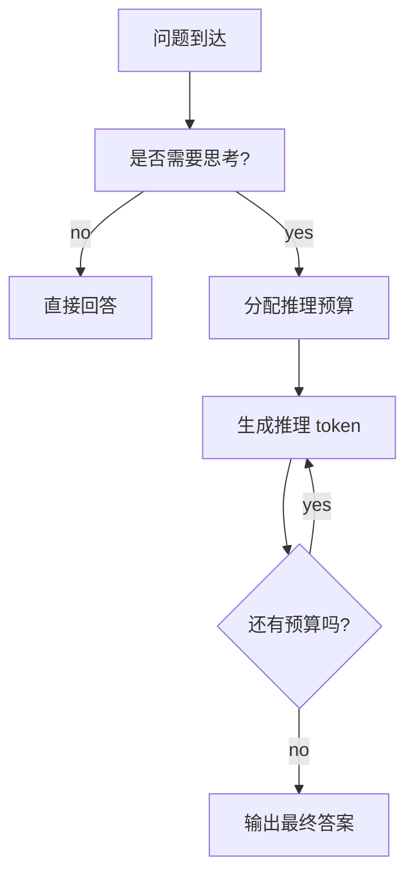

# 第 20 天：自适应推理预算 - 让 LLM 别再过度思考

> **观看动画**: 

## 一句话总结

自适应推理预算会让模型在简单问题上少想一点、在困难问题上多想一点，从而降低延迟和 overthinking，同时不至于把真正难题的推理深度一起砍掉。

---

## 为什么这很重要

### 固定思考长度，本来就是个糟糕默认值

现在很多推理模型都带有显式的 "thinking mode"，但固定预算会同时制造两种相反的失败：

1. **过度思考**：简单问题也生成一大串没必要的推理 token
2. **思考不足**：困难问题还没推理到关键处就被截断

这正是 **Plan-and-Budget** 和 **Think in Blocks** 一类工作最近在集中处理的问题。

### 前沿关注点，已经从"模型能不能推理"转向"模型能不能高效推理"

这个主题值得做日报，不是因为某一篇论文独热，而是因为三路信号都在收敛：

- **arXiv**：近期论文开始把预算分配和自适应推理深度形式化
- **Hugging Face Papers**：对应论文已经有明显的社区可见度
- **Reddit / r/LocalLLaMA**：实际部署者正在持续调 `thinking_budget` 和 `reasoning-budget`，专门处理 Qwen 类模型的 overthinking

所以今天真正的热点概念不是某一篇 paper，而是：

**推理深度应该可控，而且应该随问题难度变化。**

---

## 核心洞察

### 1. 推理 token 本质上就是计算预算

推理模型往往会在最终答案前先生成一段隐藏或可见的"思考 token"。这些 token 不是免费的：

- 会增加延迟
- 会增加服务成本
- 对简单问题来说，想太久反而可能把答案想坏

因此，推理 token 的数量应该被当成预算，而不是固定仪式。

### 2. 正确预算取决于题目难度

一种更合理的策略是：

- 简单题 -> 很短甚至零推理
- 中等题 -> 中等长度推理
- 困难题 -> 更长推理

听起来很自然，但很多当前推理系统仍然在做更粗糙的事情：

- 永远打开 thinking mode
- 设置一个统一的最大预算
- 指望模型自己收敛

之所以效果差，是因为任务分布本来就不均匀。

### 3. 预算控制可以发生在多个层级

近期系统虽然实现方式不同，但核心原则一致：

- **全局预算**：限制总推理 token 数
- **块级预算**：先预测需要几个 reasoning block
- **子问题预算**：先做分解，再给每个子步骤分配不同预算

它们共享同一个高层思想：

**先估计不确定性在哪里，再把计算花在那里，而不是平均乱花。**

---

## 架构流程



### 更贴近工程实现的视角



这件事真正有价值的地方在于：

- 不是每个任务都需要同样的推理深度
- 不是每条思维链都该跑到同一个大上限
- 退出规则和模型本身同样重要

---

## 数学形式化

### 从难度映射到预算

设难度估计器输出一个标量：

$$
d(x) \in [0, 1]
$$

其中值越大，说明输入 $x$ 越难。

我们可以把它映射为推理 token 预算：

$$
B(x) = B_{\min} + (B_{\max} - B_{\min}) \cdot d(x)
$$

其中：

- $B_{\min}$ 是最小推理预算
- $B_{\max}$ 是最大推理预算
- $B(x)$ 是输入 $x$ 的分配预算

### 块级推理

如果系统按 reasoning block 而不是原始 token 来控制深度，可以先预测：

$$
K(x) = \left\lfloor K_{\max} \cdot d(x) \right\rfloor
$$

其中 $K(x)$ 表示需要多少个 reasoning block。

这正是块级方法的关键动作：先决定"要想多深"，再在这个范围内生成。

### 效率感知目标

一个简单的效用视角可以写成：

$$
U(x) = \mathrm{Acc}(x) - \lambda \cdot \mathrm{Cost}(x)
$$

其中：

- $\mathrm{Acc}(x)$ 是预期答案质量
- $\mathrm{Cost}(x)$ 是 token 或延迟成本
- $\lambda$ 控制额外推理有多贵

部署时真正要优化的，是找到一个预算策略，让整个任务分布上的期望效用最大。

### 为什么会出现 overthinking

如果模型在有用推理结束后还被迫继续，质量常常会变平甚至下降：

$$
Q(T) \approx Q^\* - \gamma \cdot \max(0, T - T^\*)
$$

其中：

- $T^\*$ 是有效推理长度
- $Q^\*$ 是峰值质量
- $\gamma$ 表示超过最优点后的退化速度

这和 Day 12 是直接相连的：自适应预算是更上层的策略，而提前停止只是其中一种具体退出机制。

---

## Python 代码实现

```python
from dataclasses import dataclass
from typing import Iterable, List


@dataclass
class BudgetDecision:
    name: str
    difficulty: float
    reasoning_tokens: int
    answer_quality: float


class AdaptiveBudgetPolicy:
    """
    把 [0, 1] 的难度分数映射为推理 token 预算。
    """

    def __init__(self, min_budget: int = 0, max_budget: int = 12000) -> None:
        self.min_budget = min_budget
        self.max_budget = max_budget

    def allocate(self, difficulty: float) -> int:
        clipped = min(1.0, max(0.0, difficulty))
        return int(self.min_budget + clipped * (self.max_budget - self.min_budget))


def simulated_quality(difficulty: float, budget: int) -> float:
    """
    一个玩具版质量曲线：
    - 难题需要更多 token 才会涨质量
    - 简单题会很早饱和，继续想可能 overthink
    """
    target = 1500 + int(9000 * difficulty)
    gap = abs(budget - target)
    base = 1.0 - min(gap / max(target, 1), 1.0)

    if difficulty < 0.3 and budget > 4000:
        base -= 0.20

    return round(max(0.0, min(1.0, base)), 3)


def evaluate(policy: AdaptiveBudgetPolicy, items: Iterable[tuple[str, float]]) -> List[BudgetDecision]:
    decisions: List[BudgetDecision] = []
    for name, difficulty in items:
        budget = policy.allocate(difficulty)
        quality = simulated_quality(difficulty, budget)
        decisions.append(BudgetDecision(name, difficulty, budget, quality))
    return decisions


if __name__ == "__main__":
    policy = AdaptiveBudgetPolicy(min_budget=500, max_budget=12000)
    tasks = [
        ("easy arithmetic", 0.10),
        ("multi-hop QA", 0.45),
        ("olympiad math", 0.90),
    ]

    for item in evaluate(policy, tasks):
        print(
            f"{item.name:16s} "
            f"difficulty={item.difficulty:.2f} "
            f"budget={item.reasoning_tokens:5d} "
            f"quality={item.answer_quality:.3f}"
        )
```

---

## 自适应推理预算给我们的启发

1. **推理质量有一部分其实是计算分配问题，而不只是模型规模问题。**
2. **统一的全局 thinking budget，通常是错误的系统策略。**
3. **overthinking 不只是体验问题，它本身就是效率和质量的失败模式。**
4. **预算控制既可以做成产品参数，也可以做成调度器，甚至学成模型策略。**
5. **下一代推理系统大概率会把 planning、confidence signal 和显式 budget control 结合起来。**

---

## 相关教程

- [Day 04: 推理时计算扩展](/tutorials/zh/inference/04-test-time-compute.md)
- [Day 12: 基于置信度动态的提前停止](/tutorials/zh/inference/12-early-stopping.md)
- [Day 19: 循环语言模型 - 用重复深度换取潜在推理](/tutorials/zh/architecture/19-looped-language-models.md)

---

## 参考资料

- [Plan and Budget: Effective and Efficient Test-Time Scaling on Large Language Model Reasoning](https://arxiv.org/abs/2505.16122) - 2025-05-22
- [Hugging Face Papers: Plan and Budget](https://huggingface.co/papers/2505.16122)
- [Think in Blocks: Adaptive Reasoning from Direct Response to Deep Reasoning](https://arxiv.org/abs/2508.15507) - 2025-08-21
- [Hugging Face Papers: Think in Blocks](https://huggingface.co/papers/2508.15507)
- [Qwen3 Technical Report](https://arxiv.org/abs/2505.09388) - 2025-05-14
- [Hugging Face Papers: Qwen3 Technical Report](https://huggingface.co/papers/2505.09388)
- [r/LocalLLaMA: How `thinking_budget` effect in Qwen3?](https://www.reddit.com/r/LocalLLaMA/comments/1kma57b/) - 2025-05-14
- [r/LocalLLaMA: llama.cpp now with a true reasoning budget!](https://www.reddit.com/r/LocalLLaMA/comments/1rr6wqb/llamacpp_now_with_a_true_reasoning_budget/) - 2026-03-11
- [r/LocalLLaMA: Qwen3.5 overthinking anxiety duct tape fix](https://www.reddit.com/r/LocalLLaMA/comments/1rv44vo/qwen35_overthinking_anxiety_duct_tape_fix/) - 2026-03-16
