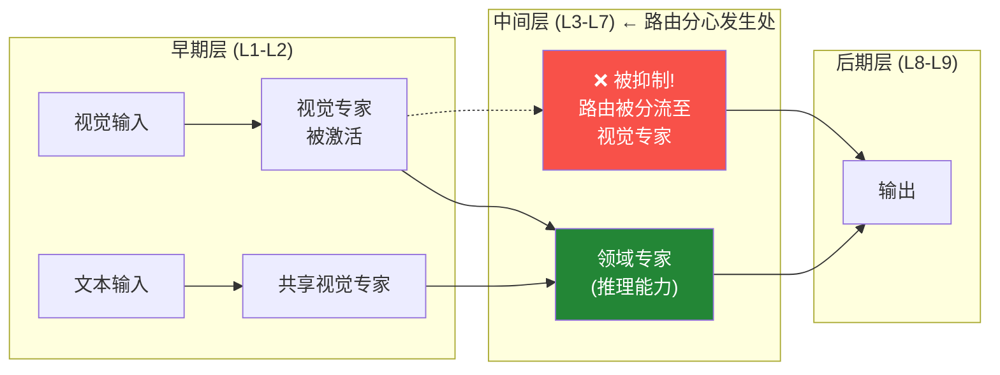

# 第 16 天: 视觉感知却未思考 — 多模态 MoE 中的路由分心现象
# Day 16: Seeing but Not Thinking — Routing Distraction in Multimodal MoE

> **日期**: 2026-04-12 | **难度**: 高级 | **分类**: MoE + 多模态
> **动画**: 

## 一句话总结

多模态 MoE 模型存在"看得见但不会思考"的缺陷：它们能正确感知图像内容，却在后续推理中失败——因为视觉输入干扰了路由机制，使其无法激活领域专家（domain experts）。

---

## 背景 | Background

### 相关教程

- [第 02 天: 混合专家系统](/tutorials/zh/moe/02-mixture-of-experts.md) — MoE 基础（专家、路由、top-k）
- [第 07 天: RBF 注意力](/tutorials/zh/attention/07-rbf-attention.md) — 注意力的路由机制

### 为什么会引起关注

MoE 模型将 token 路由到专门的"专家"（FFN 子层）。当同一个模型同时处理图像和文本时，直觉上视觉 token 应该激活视觉专家，文本 token 应该激活语言专家。但这篇论文发现了一个**反直觉的失败模式**：视觉输入会主动抑制推理所需的领域专家——即使模型在纯文本形式下能轻松解决相同的问题。

---

## 核心发现：路由分心 | Key Insight: Routing Distraction

### 现象 | The Phenomenon

```
问题（文本形式）:    "一列火车4小时行驶240英里，速度是多少？"
  → 答案: 60 mph ✓（模型正确解答）

问题（图像形式）:    [将同样的文字问题以纸上文字的图像呈现]
  → 答案: 失败 ✗（模型答错）
```

模型能理解图像中的内容，但在推理步骤失败。这**不是**视觉-语言对齐问题——模型准确感知了图像。问题出在**感知之后的推理阶段**。

### 根因：层级分离 | Root Cause: Layer-wise Separation

分析发现，视觉和文本输入在不同**中间层**（L3–L7）路由到不同的专家——而这里正是领域推理专家集中的地方：



关键发现：**图像输入在中间层引起显著的路由散度**，路由机制无法激活处理视觉输入时任务相关的推理专家。

### 路由分心假设 | Routing Distraction Hypothesis

当处理视觉输入时，路由器分配过多槽位给视觉领域专家，导致负责通用推理的领域专家资源不足。即使任务是纯推理任务（如解数学应用题），这种情况也会发生。

### 验证：路由引导干预 | Validation: Routing-Guided Intervention

作者提出一个简单干预：先识别哪个专家负责通用推理（通过分析文本任务的路由模式），然后在处理视觉输入时**增强该专家的激活权重**。

```python
def routing_guided_intervention(router_weights, domain_expert_id, boost=1.3):
    """
    router_weights: [num_tokens, num_experts] 路由分数
    domain_expert_id: 领域（推理）专家的索引
    boost: 领域专家激活的乘法增强因子
    """
    boosted = router_weights.clone()
    boosted[:, domain_expert_id] *= boost

    # 重新归一化，使权重和为1
    boosted = boosted / boosted.sum(dim=-1, keepdim=True)
    return boosted
```

结果：在三个多模态 MoE 模型上，复杂视觉推理任务提升高达 **+3.17%**。

---

## 数学表述 | Mathematical Formulation

### 标准 MoE 路由 | Standard MoE Routing

对于 token $\mathbf{h}_t$，路由器计算：

$$P(e_i | \mathbf{h}_t) = \text{softmax}(\mathbf{W}_r \mathbf{h}_t)_i = \frac{\exp(\mathbf{w}_i^\top \mathbf{h}_t)}{\sum_{j=1}^{E} \exp(\mathbf{w}_j^\top \mathbf{h}_t)}$$

选择 top-$k$ 个专家：$\mathcal{E}_t = \text{Top}_k(P(e | \mathbf{h}_t))$

### 路由散度度量 | Routing Divergence Measurement

视觉和文本路由在第 $\ell$ 层之间的散度：

$$\Delta_\ell = \frac{1}{T} \sum_{t=1}^{T} \| \mathbf{p}_t^\text{img} - \mathbf{p}_t^\text{text} \|_1$$

其中 $\mathbf{p}_t^\text{img}$ 和 $\mathbf{p}_t^\text{text}$ 是同一 token 在图像 vs. 文本模态下的路由概率分布。

关键发现：$\Delta_\ell$ 在中间层（$\ell \in [3, 7]$）达到峰值，确认了层级分离现象。

### 路由引导干预 | Routing-Guided Intervention

增强后的路由概率：

$$P'(e_i | \mathbf{h}_t) = \text{softmax}\left( \mathbf{W}_r \mathbf{h}_t + \mathbf{b}_i^\text{boost} \right)_i$$

其中 $\mathbf{b}_i^\text{boost} = \gamma \cdot \mathbb{1}[i = e^*]$，$e^*$ 是已识别的领域专家，$\gamma > 0$。

---

## 代码 | Code

```python
import torch
import torch.nn as nn
import torch.nn.functional as F

class MultimodalMoERouter(nn.Module):
    """
    标准 MoE 路由器，含路由分心分析功能。
    """
    def __init__(self, d_model: int, num_experts: int, top_k: int = 2):
        super().__init__()
        self.num_experts = num_experts
        self.top_k = top_k
        self.gate = nn.Linear(d_model, num_experts, bias=False)

    def forward(self, x: torch.Tensor) -> tuple:
        """
        x: [batch, seq, d_model]
        返回: top_k 专家索引, top_k 权重, 路由概率
        """
        # 路由器分数: [batch, seq, num_experts]
        logits = self.gate(x)
        probs = F.softmax(logits, dim=-1)

        # Top-k 选择
        top_k_probs, top_k_ids = torch.topk(probs, self.top_k, dim=-1)
        top_k_probs = top_k_probs / top_k_probs.sum(dim=-1, keepdim=True)  # 重新归一化

        return top_k_ids, top_k_probs, probs


class RoutingGuidedIntervention(nn.Module):
    """
    应用路由引导干预，增强领域专家激活。
    """
    def __init__(self, d_model: int, num_experts: int, top_k: int = 2,
                 domain_expert_id: int = 1, boost_factor: float = 1.3):
        super().__init__()
        self.router = MultimodalMoERouter(d_model, num_experts, top_k)
        self.domain_expert_id = domain_expert_id
        self.boost_factor = boost_factor

    def compute_divergence(self, probs_img: torch.Tensor,
                           probs_text: torch.Tensor) -> torch.Tensor:
        """
        计算模态间 L1 路由散度。
        probs: [batch, seq, num_experts]
        """
        return (probs_img - probs_text).abs().mean(dim=[1, 2])

    def forward(self, x: torch.Tensor,
                is_visual: bool = False) -> tuple:
        """
        x: [batch, seq, d_model]
        is_visual: 输入是否为视觉模态
        """
        top_k_ids, top_k_probs, probs = self.router(x)

        if is_visual and self.domain_expert_id is not None:
            # 对视觉输入增强领域专家激活
            boosted_probs = probs.clone()
            boosted_probs[:, self.domain_expert_id] *= self.boost_factor
            boosted_probs = boosted_probs / boosted_probs.sum(dim=-1, keepdim=True)

            # 重新计算 top-k
            top_k_probs_new, top_k_ids_new = torch.topk(
                boosted_probs, self.top_k, dim=-1
            )
            top_k_probs_new = top_k_probs_new / top_k_probs_new.sum(dim=-1, keepdim=True)
            return top_k_ids_new, top_k_probs_new, boosted_probs

        return top_k_ids, top_k_probs, probs


# --- 演示 ---
if __name__ == "__main__":
    batch, seq, d_model = 2, 16, 64
    num_experts = 6
    x = torch.randn(batch, seq, d_model)

    model = RoutingGuidedIntervention(
        d_model=d_model,
        num_experts=num_experts,
        top_k=2,
        domain_expert_id=1,    # 专家1 = 领域推理专家
        boost_factor=1.3
    )

    # 文本输入：标准路由
    top_k_ids, top_k_probs, probs = model(x, is_visual=False)
    print(f"文本路由 - 专家1激活值: {probs[:, :, 1].mean().item():.3f}")

    # 视觉输入：增强后路由
    top_k_ids_v, top_k_probs_v, probs_v = model(x, is_visual=True)
    print(f"视觉（增强后）- 专家1激活值: {probs_v[:, :, 1].mean().item():.3f}")

    # 无干预（对比）
    model_no_int = MultimodalMoERouter(d_model, num_experts, top_k=2)
    _, _, probs_baseline = model_no_int(x)
    print(f"视觉（无干预）- 专家1激活值: {probs_baseline[:, :, 1].mean().item():.3f}")
```

---

## 核心要点 | Key Takeaways

1. **"看得见但不会思考"** 是多模态 MoE 中真实的失败模式，不是幻觉或对齐问题
2. **中间层是瓶颈** — 路由散度在 L3–L7 达到峰值，而非早期或晚期层
3. **领域专家 = 推理专家** — 处理文本推理的专家同样处理视觉推理（相同的认知功能）
4. **简单干预有效** — 将领域专家激活增强 1.3 倍，视觉推理提升高达 3.17%
5. **跨任务迁移** — 领域专家识别可以跨任务迁移，因为它识别的是认知功能，而非样本特定的解决方案

---

## 参考文献 | References

- **论文**: [Seeing but Not Thinking: Routing Distraction in Multimodal Mixture-of-Experts](https://arxiv.org/abs/2604.08541) — Xu et al., 2026-04-09
- **相关（第 02 天）**: [混合专家系统](/tutorials/zh/moe/02-mixture-of-experts.md)
- **相关（第 07 天）**: [RBF 注意力](/tutorials/zh/attention/07-rbf-attention.md)
