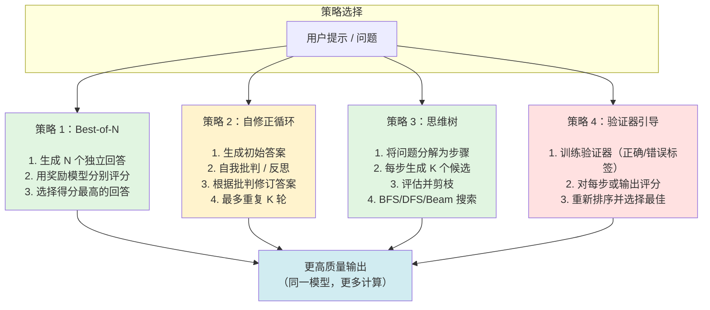
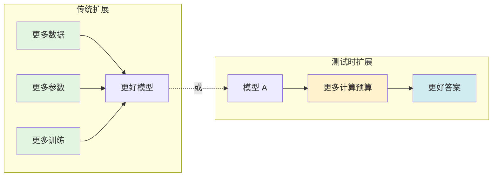

# 第 04 天：测试时计算扩展（Test-Time Compute Scaling）—— 更多推理预算，更优输出

> **观看动画演示**：

## 快速参考

| 术语 | 定义 |
|---|---|
| Best-of-N | 生成 N 个独立回答，分别评分，选择最高分答案 |
| 自修正 / Reflexion | 生成、批判、修订——迭代优化循环 |
| 思维树（Tree of Thoughts） | 在可能的推理路径树上进行系统性搜索 |
| 验证器引导解码 | 使用训练好的奖励/验证模型对生成结果进行评分和引导 |
| 过程奖励（PRM） | 对中间推理步骤评分，而非仅对最终答案评分 |
| 结果奖励（ORM） | 仅对最终答案/完整解决方案评分 |

## 一句话概要

测试时计算扩展策略在固定模型上分配额外的推理预算，通过 Best-of-N 采样、自修正循环、树状推理搜索和验证器引导解码等策略生成更高质量的输出——以延迟换取质量。

## 为什么重要

传统的扩展定律聚焦于更多数据、更多参数量或更多训练计算。**测试时计算扩展**开辟了一个全新的优化维度：在推理阶段使用额外计算来提升质量。其重要性体现在：

1. 适用于任何预训练模型——无需重新训练
2. 计算预算可按查询调整，而非在训练时固定
3. 经过精心设计的策略（尤其在推理任务上）能带来显著的性能提升
4. 它能解锁新的能力层级（例如，配备测试时计算的 7B 模型在某些任务上可以超越原始的 70B 模型）
5. 权衡是明确且可控的：你可以选择延迟与质量的平衡点

## 架构图



## 数学原理

### Best-of-N：概率性扩展

给定生成器 $P_\theta$ 和奖励函数 $R$，我们采样 $N$ 个独立回答 $y_1, ..., y_N \sim P_\theta(y | x)$，然后选择：

$$y^* = \arg\max_{i \in \{1,...,N\}} R(y_i, x)$$

最大奖励超过阈值 $\tau$ 的概率为：

$$P\left(\max_i R(y_i, x) > \tau\right) = 1 - F_R(\tau)^N$$

其中 $F_R$ 是奖励分布的累积分布函数。随着 $N$ 增大，该概率趋近于 1。然而，**收益递减效应**会显现：

$$\frac{\partial}{\partial N} P = -F_R(\tau)^N \log F_R(\tau)$$

边际增益呈指数衰减，这就是为什么在大多数基准测试中，当 $N$ 超过 32 到 64 之后，再增加 $N$ 带来的改进微乎其微。

### 自修正：迭代改进

在反思循环中，设 $f_\theta$ 表示生成答案的模型，$f_\theta^{\text{critic}}$ 表示批判函数（可以是同一模型，但使用不同的提示词）。经过 $k$ 轮后：

$$y^{(k+1)} = f_\theta\left(x, y^{(k)}, f_\theta^{\text{critic}}(x, y^{(k)})\right)$$

第 $k$ 步的质量改进是有上限的：

$$Q(y^{(k+1)}) - Q(y^{(k)}) \to 0 \quad \text{当} \quad k \to \infty$$

模型能够改进的程度受限于其自身的批判能力。如果模型无法检测到自己的错误，自修正将收敛到相同的固定点，或者更糟——强化模型自身的偏差。

### 思维树：在推理路径上搜索

思维树将推理形式化为树搜索问题。在每一深度 $d$ 处，我们维护一个包含 $B$ 个候选状态的集束：$\{s_d^{(1)}, ..., s_d^{(B)}\}$。状态的价值定义为：

$$V(s_d) = \mathbb{E}[R(y) | \text{当前推理轨迹 } s_d]$$

在每次扩展步骤中，我们为每个状态生成 $K$ 个候选的下一步思路并对其进行评估：

$$s_{d+1}^{(j)} = f_\theta\left(\text{prompt}(s_d^{(i)})\right), \quad j \in \{1, ..., K\}$$

然后剪枝保留前 $B$ 个状态：

$$\mathcal{B}_{d+1} = \text{Top}_B\left(\bigcup_{i=1}^B \{s_{d+1}^{(i,1)}, ..., s_{d+1}^{(i,K)}\}\right)$$

探索的总搜索空间最大可达 $(B \times K)^D$（深度 $D$），比单一生成路径的大小 $1$ 呈指数级增长。

### 过程奖励 vs 结果奖励模型

|  | 结果奖励模型（ORM） | 过程奖励模型（PRM） |
|---|---|---|
| 评分对象 | 仅最终答案 | 每个推理步骤 |
| 所需标注 | 答案级标签 | 步骤级标签 |
| 判别能力 | 粗糙 | 精细 |
| 计算成本 | 低（一次调用） | 高（每步一次调用） |
| 错误定位 | 无法定位错误步骤 | 能识别推理偏离点 |

PRM 为每个推理步骤 $t$ 分配一个分数 $s_t$：

$$s_t = V_{\text{PRM}}(x, s_1, ..., s_t)$$

整体方案分数可以聚合为：

$$S_{\text{solution}} = \frac{1}{T} \sum_{t=1}^T s_t \quad \text{或} \quad S_{\text{solution}} = \min_{t=1}^T s_t$$

使用最小值更为保守：一个糟糕的推理步骤就会否决整个解决方案，这与数学推理的工作方式一致（一步错误则整个证明无效）。

### 计算最优分配

对于固定的推理计算预算 $C$（以前向传播次数计量），最优分配需要平衡样本数量和单样本计算量：

$$C = N \times (c_{\text{generate}} + c_{\text{verify}})$$

其中 $c_{\text{generate}}$ 是每次生成的计算成本，$c_{\text{verify}}$ 是验证成本。最优策略取决于任务难度分布和模型的能力上限。

Wu 等人（2024）的近期研究表明，每个任务难度都存在一个最优的 $N_{\text{optimal}}$，而且当模型的能力上限限制了可达到的最高质量时，盲目增加 $N$ 只会浪费计算资源。

## 完整 Python 实现

```python
"""
测试时计算扩展（Test-Time Compute Scaling）—— 推理时智能
第 04 天教程 —— Advanced AI Daily
"""

from __future__ import annotations
from dataclasses import dataclass, field
from typing import Callable, List, Optional, Tuple


# ------------------------------------------------------------------
# 策略 1：Best-of-N 采样
# ------------------------------------------------------------------
def best_of_n(
    prompt: str,
    generator: Callable[[str, float], str],
    scorer: Callable[[str, str], float],
    n: int = 10,
    temperature: float = 0.7,
) -> Tuple[str, float, List[Tuple[str, float]]]:
    """
    生成 N 个独立回答，选择得分最高的一个。

    参数:
        prompt: 输入问题或问题陈述
        generator: 可调用对象 (prompt, temperature) -> 回答字符串
        scorer: 可调用对象 (question, answer) -> 浮点分数
        n: 独立生成的数量
        temperature: 采样温度（越高越多样化）

    返回:
        best_answer: 得分最高的回答
        best_score: 最佳回答的分数
        all_scored: 所有（回答, 分数）对的列表
    """
    all_scored: list[tuple[str, float]] = []

    for i in range(n):
        response = generator(prompt, temperature)
        score = scorer(prompt, response)
        all_scored.append((response, score))

    # 按分数降序排序
    all_scored.sort(key=lambda x: x[1], reverse=True)
    best_answer, best_score = all_scored[0]

    return best_answer, best_score, all_scored


# ------------------------------------------------------------------
# 策略 2：自修正 / Reflexion
# ------------------------------------------------------------------
@dataclass
class ReflexionRound:
    """表示反思循环中的一轮。"""

    round_number: int
    current_answer: str
    critique: str
    revised_answer: str


def reflexion_loop(
    prompt: str,
    generator: Callable[[str, float], str],
    max_rounds: int = 3,
    temperature: float = 0.7,
) -> Tuple[str, List[ReflexionRound]]:
    """
    运行反思循环：生成、批判、修订，迭代进行。

    参数:
        prompt: 输入问题或问题陈述
        generator: 可调用对象 (prompt, temperature) -> 回答字符串
        max_rounds: 批判-修订循环的最大轮数
        temperature: 采样温度

    返回:
        final_answer: 所有反思轮次后的最终答案
        history: 包含所有反思轮次及批判的列表
    """
    # 初始生成
    current_answer = generator(prompt, temperature)
    history: list[ReflexionRound] = []

    for round_idx in range(1, max_rounds + 1):
        # 自我批判
        critique_prompt = (
            f"问题：{prompt}\n\n"
            f"你的解答：\n{current_answer}\n\n"
            f"请仔细审查此解答。识别任何错误、遗漏或改进之处。"
            f"请具体说明。\n\n批判："
        )
        critique = generator(critique_prompt, temperature=0.3)

        # 基于批判进行修订
        revision_prompt = (
            f"问题：{prompt}\n\n"
            f"你的原始解答：\n{current_answer}\n\n"
            f"你对解答的批判：\n{critique}\n\n"
            f"根据此批判，提供修订后的改进解答。\n\n修订后的解答："
        )
        revised = generator(revision_prompt, temperature)

        history.append(ReflexionRound(
            round_number=round_idx,
            current_answer=current_answer,
            critique=critique,
            revised_answer=revised,
        ))
        current_answer = revised

    return current_answer, history


# ------------------------------------------------------------------
# 策略 3：思维树（Tree of Thoughts）
# ------------------------------------------------------------------
@dataclass
class TreeNode:
    """思维树推理树中的一个节点。"""

    text: str
    parent: Optional["TreeNode"] = None
    evaluation: float = 0.0
    children: list["TreeNode"] = field(default_factory=list)
    depth: int = 0

    def trace(self) -> str:
        """从根节点到此节点的完整推理轨迹。"""
        if self.parent is None:
            return self.text
        return self.parent.trace() + "\n" + self.text


class TreeOfThoughts:
    """
    带束搜索的思维树求解器，在推理路径上进行搜索。

    实现 Yao 等人（2023）的 ToT 方法，使用束搜索系统地
    探索最有希望的推理路径。
    """

    def __init__(
        self,
        generator: Callable[[str, float], str],
        evaluator: Callable[[str, str], float],
        k: int = 5,
        beam_width: int = 3,
        max_depth: int = 5,
        temperature: float = 0.7,
    ):
        """
        参数:
            generator: 可调用对象 (prompt, temperature) -> 回答字符串
            evaluator: 可调用对象 (partial_trace, original_problem) -> 浮点分数
            k: 每个节点生成的候选思路数量
            beam_width: 每层保留的顶部节点数量
            max_depth: 树的最大深度（推理步骤数）
            temperature: 生成的采样温度
        """
        self.generator = generator
        self.evaluator = evaluator
        self.k = k
        self.beam_width = beam_width
        self.max_depth = max_depth
        self.temperature = temperature
        self.total_nodes_explored = 0

    def solve(self, problem: str) -> Tuple[str, int]:
        """
        运行思维树搜索，返回最佳推理路径。

        参数:
            problem: 要解决的问题

        返回:
            best_trace: 最佳路径的完整推理轨迹
            total_nodes: 探索的树节点总数
        """
        root = TreeNode(text=problem)
        beam: list[TreeNode] = [root]

        for depth in range(self.max_depth):
            next_beam: list[TreeNode] = []

            for node in beam:
                candidates = self._generate_candidates(node, problem)
                next_beam.extend(candidates)

            if not next_beam:
                break

            # 按评估分数剪枝，保留前 beam_width 个
            next_beam.sort(key=lambda n: n.evaluation, reverse=True)
            beam = next_beam[: self.beam_width]

        # 返回最佳叶子节点的完整轨迹
        beam.sort(key=lambda n: n.evaluation, reverse=True)
        best = beam[0]

        return best.trace(), self.total_nodes_explored

    def _generate_candidates(self, node: TreeNode, problem: str) -> list[TreeNode]:
        """从当前节点生成 k 个候选的下一步思路。"""
        prompt = (
            f"问题：{problem}\n\n"
            f"目前的推理过程：\n{node.trace()}\n\n"
            f"请提供 {self.k} 个不同的可能下一步思考。"
            f"分别编号为 1 到 {self.k}。"
        )

        raw_response = self.generator(prompt, self.temperature)

        candidates: list[TreeNode] = []
        # 简单解析：按编号项分割
        lines = [line.strip() for line in raw_response.split("\n") if line.strip()]

        for i, line in enumerate(lines[: self.k]):
            child = TreeNode(
                text=line,
                parent=node,
                depth=node.depth + 1,
            )
            child.evaluation = self.evaluator(child.trace(), problem)
            candidates.append(child)
            self.total_nodes_explored += 1

        return candidates


# ------------------------------------------------------------------
# 策略 4：验证器引导解码
# ------------------------------------------------------------------
def verifier_rerank(
    prompt: str,
    generator: Callable[[str, float], str],
    verifier: Callable[[str, str], float],
    n: int = 10,
    temperature: float = 0.7,
) -> Tuple[str, float, List[Tuple[str, float]]]:
    """
    生成 N 个回答，使用训练好的验证器重新排序。

    功能上与 best_of_n 类似，但强调使用专用的验证模型
    （在正确/错误标签上训练），而非通用评分器。

    参数:
        prompt: 输入问题或问题
        generator: 可调用对象 (prompt, temperature) -> 回答
        verifier: 可调用对象 (question, answer) -> 置信度分数
        n: 生成的候选数量
        temperature: 采样温度

    返回:
        best_answer: 验证器选择的答案
        best_score: 验证器置信度分数
        all_scored: 所有候选及其验证器分数
    """
    candidates: list[tuple[str, float]] = []

    for _ in range(n):
        answer = generator(prompt, temperature)
        score = verifier(prompt, answer)
        candidates.append((answer, score))

    candidates.sort(key=lambda x: x[1], reverse=True)
    best_answer, best_score = candidates[0]

    return best_answer, best_score, candidates


# ------------------------------------------------------------------
# 过程奖励与结果奖励对比
# ------------------------------------------------------------------
def compare_reward_granularity(
    solution_steps: List[str],
    process_reward_model: Callable[[List[str], int], float],
    outcome_reward_model: Callable[[str], float],
    full_solution: str,
) -> dict:
    """
    在同一解决方案上比较过程级与结果级验证。

    参数:
        solution_steps: 各个推理步骤
        process_reward_model: 可调用对象 (steps, step_index) -> 分数
        outcome_reward_model: 可调用对象 (full_text) -> 分数
        full_solution: 完整解决方案文本

    返回:
        包含过程分数、结果分数及其比较结果的字典
    """
    # 结果奖励：对完整解决方案给出单一分数
    outcome_score = outcome_reward_model(full_solution)

    # 过程奖励：对每个步骤单独评分
    process_scores = []
    for i in range(len(solution_steps)):
        score = process_reward_model(solution_steps, i)
        process_scores.append(score)

    aggregate_process = sum(process_scores) / len(process_scores) if process_scores else 0.0
    minimum_process = min(process_scores) if process_scores else 0.0

    return {
        "outcome_score": outcome_score,
        "process_scores": process_scores,
        "aggregate_process": aggregate_process,
        "minimum_process": minimum_process,
        "disagreement": abs(outcome_score - aggregate_process),
    }


# ------------------------------------------------------------------
# 示例用法
# ------------------------------------------------------------------
if __name__ == "__main__":
    # 模拟生成器和评分器用于演示
    import random

    random.seed(42)

    def mock_generator(prompt: str, temperature: float = 0.7) -> str:
        """模拟生成回答。"""
        quality = random.gauss(0.5, 0.2 / temperature)
        correct = "正确" if quality > 0.5 else "错误"
        return f"回答（质量={quality:.3f}）：{correct}"

    def mock_scorer(question: str, answer: str) -> float:
        """模拟回答评分。"""
        return random.random()

    def mock_verifier(question: str, answer: str) -> float:
        """模拟验证器置信度。"""
        return random.random()

    def mock_process_prm(steps: list[str], step_idx: int) -> float:
        """模拟特定步骤的过程奖励。"""
        return random.random()

    def mock_outcome_orm(text: str) -> float:
        """模拟完整文本的结果奖励。"""
        return random.random()

    question = "小于 10 的所有质数之和是多少？"

    # --- Best-of-N ---
    print("=" * 60)
    print("策略 1：Best-of-N（N=5）")
    print("=" * 60)
    best, score, all_scored = best_of_n(
        question, mock_generator, mock_scorer, n=5, temperature=0.7
    )
    print(f"最佳回答：{best}")
    print(f"最高分数：{score:.4f}")
    print(f"所有分数：{[s for _, s in all_scored]}")

    # --- Reflexion ---
    print()
    print("=" * 60)
    print("策略 2：反思循环（3 轮）")
    print("=" * 60)
    final_answer, history = reflexion_loop(question, mock_generator, max_rounds=3)
    print(f"最终答案：{final_answer[:80]}...")
    print(f"完成轮数：{len(history)}")

    # --- Tree of Thoughts ---
    print()
    print("=" * 60)
    print("策略 3：思维树")
    print("=" * 60)
    tot = TreeOfThoughts(
        generator=mock_generator,
        evaluator=lambda trace, prob: random.random(),
        k=3,
        beam_width=2,
        max_depth=3,
    )
    trace, nodes = tot.solve(question)
    print(f"最佳轨迹（前 100 字符）：{trace[:100]}...")
    print(f"探索的节点总数：{nodes}")

    # --- Verifier Re-rank ---
    print()
    print("=" * 60)
    print("策略 4：验证器引导重新排序（N=5）")
    print("=" * 60)
    v_best, v_score, v_all = verifier_rerank(
        question, mock_generator, mock_verifier, n=5
    )
    print(f"最佳回答：{v_best}")
    print(f"验证器分数：{v_score:.4f}")

    # --- Process vs. Outcome Reward ---
    print()
    print("=" * 60)
    print("过程奖励 vs 结果奖励 对比")
    print("=" * 60)
    steps = ["步骤 1：找出小于 10 的所有质数", "步骤 2：将它们相加"]
    comparison = compare_reward_granularity(
        solution_steps=steps,
        process_reward_model=mock_process_prm,
        outcome_reward_model=mock_outcome_orm,
        full_solution="\n".join(steps),
    )
    print(f"结果分数：{comparison['outcome_score']:.4f}")
    print(f"过程分数：{[f'{s:.4f}' for s in comparison['process_scores']]}")
    print(f"聚合（均值）：{comparison['aggregate_process']:.4f}")
    print(f"最小值：{comparison['minimum_process']:.4f}")
    print(f"差异：{comparison['disagreement']:.4f}")
```

## 深入解析

### 1. 推理时计算的范式转变

传统 AI 进步遵循的公式是：更多数据 + 更多参数 + 更多训练计算 = 更好模型。测试时计算扩展揭示了一个**正交的改进维度**，这个维度一直存在但一直被系统性低估。

核心洞察在于：模型的知识不仅仅编码在其权重中——它还可以通过推理时的深思熟虑计算来解锁。这类似于人类智能：一个人花更长时间思考、尝试多种方法并检查自己的工作，会产出比脱口而出第一个答案更好的结果，即使其基础知识是一样的。

2024 年发现的"慢速"（slow）扩展定律表明，推理任务的性能遵循测试时计算的幂律关系，类似于训练时扩展定律。将推理预算翻倍可以在某些任务上产生相当于大得多模型的性能增益。



### 2. Best-of-N 中的收益递减

Best-of-N 的改进遵循凹曲线。在数学问题上，将 $N$ 从 1 增加到 10 可能带来 +15% 的准确率提升，但从 10 增加到 100 仅带来 +5%。这是因为一旦模型探索了其能力范围，额外的样本大多覆盖了输出空间中已探索的区域。

"最佳点"取决于任务难度：
- **简单任务**：较小的 $N$（3-5）就够了；模型已经知道答案
- **中等任务**：中等 $N$（10-32）能在合理的备选答案中找到正确的那个
- **困难任务**：需要较大的 $N$（64-1000），但即便如此，模型的能力上限仍限制了可达到的最高质量

### 3. 自修正有时会让结果更糟

自修正有一个根本性的限制：**模型必须能够检测自己的错误**。如果模型的错误检测能力弱于其问题解决能力，"批判"阶段会引入噪音，将解决方案推离正确答案。

Huang 等人（2023）和 Valmeekam 等人（2023）的研究表明，对于许多标准 LLM，在逻辑谜题和数学问题上的自修正实际上比单次尝试的表现更差。原因在于：

1. 模型的自我批判倾向于发现不存在的错误（假阳性）
2. 修订阶段继承了生成阶段的相同盲点
3. 在多轮迭代中，错误会累积和放大

**解决方案**：使用更强的模型进行批判阶段，或者专门在批判-修订数据对上对模型进行训练（如 Self-Refine 方法）。

### 4. 验证器质量：瓶颈所在

所有依赖排序或剪枝的测试时计算策略（Best-of-N、ToT、验证器引导解码）的质量上限取决于其验证信号的质量。如果验证器存在噪音或偏差：

- Best-of-N 会自信地选择错误答案
- ToT 会剪掉正确的推理路径，保留错误路径
- 验证器引导解码会收敛到验证器的偏好，而非真正的正确答案

这就是为什么**过程奖励模型（PRM）**是如此重要的发展：通过对中间推理步骤评分，它们提供了与最终正确性相关性更强的密集监督信号。Lightman 等人（2023）表明，步骤级验证在数学推理任务上显著优于结果级验证。

## 常见误区

| 误区 | 事实 |
|---|---|
| "更多测试时计算总是意味着更好结果" | 不对。收益递减是真实的。超过最优 N 后，边际增益趋近于零。 |
| "自修正总是有帮助的" | 不对。许多模型无法检测自身错误。缺乏良好的批判能力时，自修正会降低性能。 |
| "测试时计算可以替代训练" | 不能。它在训练模型的能力上限内工作。你仍然需要一个有能力的基座模型。 |
| "思维树总是更优的" | ToT 是昂贵的（指数增长），且仅在问题允许有意义的步骤分解时优于其他方法。 |
| "N=1000 的 Best-of-N 能击败任何模型" | 不会。如果基座模型永远无法产生正确答案，再多的抽样也无济于事。 |
| "验证器引导解码是免费的" | 训练一个好的验证器需要大量标注数据。一个差的验证器比没有验证器更糟。 |

## 练习题

1. **准确率扩展实验**：使用真实模型（即使是小模型），在 50 道数学问题上测量 $N = 1, 5, 10, 20, 50$ 的准确率，并绘制准确率曲线。是否与理论上的收益递减预测一致？
2. **自修正失败案例**：找到一个自修正使得性能比初始答案更差的任务。分析批判阶段为何引入了错误。
3. **构建思维树求解器**：为 4x4 数独谜题实现一个完整的思维树求解器。使用约束违反计数作为评估启发函数。
4. **PRM 训练**：收集 100 道数学问题的解决方案，带步骤级标注（每步正确/错误）。训练一个简单的二分类器作为过程奖励模型，评估其与最终答案正确性的相关性。
5. **计算最优分配实验**：给定 100 次前向传播的固定预算，设计实验找出样本数量和验证深度之间的最优分配。比较 Best-of-10 与 10 轮反思 vs Best-of-100 无验证。

## 扩展阅读

| 论文 | 作者 | arXiv | 核心贡献 |
|---|---|---|---|
| [Chain-of-Thought Prompting Elicits Reasoning in Large Language Models](https://arxiv.org/abs/2201.11903) | Wei 等 | 2022 | 链式思维提示：顺序推理 |
| [AlphaCode](https://arxiv.org/abs/2203.08814) | Li 等 | 2022 | 大规代码生成与排序 |
| [Self-Refine: Iterative Refinement with Self-Feedback](https://arxiv.org/abs/2303.17651) | Madaan 等 | 2023 | 模型可自我优化输出 |
| [Reflexion: Language Agents with Verbal Reinforcement Learning](https://arxiv.org/abs/2303.11366) | Shinn 等 | 2023 | 通过自我反思进行语言强化学习 |
| [Tree of Thoughts: Deliberate Problem Solving with LLMs](https://arxiv.org/abs/2305.10601) | Yao 等 | 2023 | 推理路径的系统性树搜索 |
| [Let's Verify Step by Step](https://arxiv.org/abs/2305.20050) | Lightman 等 | 2023 | 步骤级验证优于结果级验证 |
| [Self-Correction with LLMs: Are Self-Corrections Reliable?](https://arxiv.org/abs/2309.06684) | Huang 等 | 2023 | 对自修正的批判性分析 |

## 总结

| 策略 | 计算成本 | 最佳适用 | 优势 | 劣势 |
|---|---|---|---|---|
| Best-of-N | $O(N)$ 次生成 | 通用问答、编程 | 简单、稳健 | N~50 后收益递减 |
| 自修正循环 | $O(K)$ 次迭代 | 写作、推理 | 模拟迭代修订 | 批判质量瓶颈 |
| 思维树 | $O(B \cdot K)^D$ | 复杂多步骤问题 | 系统性探索 | 指数级成本 |
| 验证器引导 | $O(N)$ 生成 + 验证 | 数学、逻辑 | 密集监督信号 | 需要训练验证器 |

---

上一篇：[第 03 天：投机解码（Speculative Decoding）](03-speculative-decoding.md)  |  下一篇：[第 05 天：多智能体反射（Multi-Agent Reflection）](05-multi-agent-reflection.md)_

---

---

## Quick Quiz

Test your understanding of this topic.

### Q1. What is the core mechanism described in this tutorial?

- A. A new attention variant
- B. A training or inference algorithm
- C. A hardware optimization
- D. A dataset format

<details>
<summary>Reveal Answer</summary>

**Answer: B** — This tutorial focuses on a inference algorithm.

*Explanation varies by tutorial — see the Core Insight section for the key takeaway.*

</details>

### Q2. When does this approach work best?

- A. Only on very large models
- B. Only on small models
- C. Under specific conditions detailed in the tutorial
- D. Always, regardless of setup

<details>
<summary>Reveal Answer</summary>

**Answer: C** — The tutorial describes specific conditions and tradeoffs. Review the "Why This Matters" and "Limitations" sections.

</details>

### Q3. What is the main takeaway?

- A. Use this instead of all other approaches
- B. This is a niche optimization with no practical use
- C. A specific mechanism with clear use cases and tradeoffs
- D. This has been superseded by a newer method

<details>
<summary>Reveal Answer</summary>

**Answer: C** — Every tutorial in this repo focuses on a specific mechanism with its own tradeoffs. Check the One-Line Summary at the top and the "What [Topic] Teaches Us" section at the bottom.

</details>
