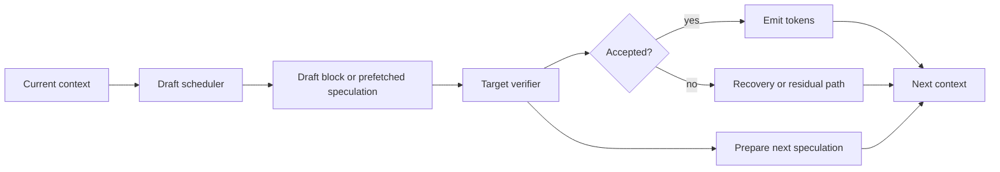

# 第 22 天：并行草稿生成 — 打破投机解码中的草稿瓶颈

> **观看动画**: 

## 一句话总结

并行草稿生成是经典 speculative decoding 的下一步：重点不再只是把 verification 做快，而是要把仍然卡在关键路径上的 draft latency 缩短或隐藏掉。

---

## 为什么这很重要

### Day 03 解决了一个瓶颈，但没有解决整条流水线

经典 speculative decoding 已经给出了一条非常强的思路：

1. 先让一个便宜的 draft model 猜出多个候选 token
2. 再让大模型一次性验证这一整段候选
3. 把 target model 的高成本摊到多个已接受 token 上

这已经是 LLM 推理栈里最耐用的加速思路之一。

但这条流水线还残留着一个系统问题：

- draft model 往往还是按自回归方式逐个生成候选
- 每一轮 speculation 仍然要为 drafting 支付实际时间
- 如果 drafting 不够快，verification 就不再是唯一瓶颈

所以前沿问题已经不只是：

**“怎样一次验证更多 token？”**

而是：

**“怎样让 draft generation 不再继续成为串行等待？”**

### 三路前沿信号再次开始收敛

这个话题适合做日报，不是因为某一篇论文很新，而是因为多路信号都指向同一机制：

- **arXiv**：像 **DFlash** 和 **Speculative Speculative Decoding** 这样的工作，都在直接攻击 draft 侧延迟
- **Hugging Face Papers**：这两篇都已经被收录为当前 inference 方向的可见工作
- **Reddit / r/LocalLLaMA**：本地部署者已经在用真实延迟、cache reuse、实测收益来讨论 speculative decoding

所以今天真正值得讲的 durable concept 不是“又一篇新的 decoding paper”。

而是：

**speculative decoding 正在从 acceptance rate 问题，转向调度与流水线问题。**

---

## 核心洞察

### 1. 经典 speculative decoding 仍然要支付串行 drafting 成本

标准的一轮流程大致是：

1. draft model 先生成 $K$ 个候选 token
2. target model 验证整段候选
3. 输出接受的 token
4. 再开启下一轮

虽然 verification 已经做成了批量检查，但 draft 侧很多时候仍然是一个从左到右的小型生成循环。

所以单轮时间更像是：

$$
T_{\mathrm{round}} \approx T_{\mathrm{draft}} + T_{\mathrm{verify}}
$$

如果 $T_{\mathrm{draft}}$ 仍然不可忽略，speculative decoding 就还没有把速度空间吃干净。

### 2. DFlash 通过 block generation 缩短 drafting 阶段

**DFlash** 的切入点，是把串行 draft-token 生成换成面向 block 的生成方式。

它不再要求 draft model 必须一颗 token 一颗 token 往前滚，而是尽量一次生成整段 draft block。

从系统角度看，效果很直接：

- 更少的串行 draft 步骤
- 更低的每轮 draft 延迟
- verifier 更容易重新成为主导吞吐的部分

这并没有改变 speculative decoding 的基本动机。
它改变的是：

**剩余延迟主要从哪里来。**

### 3. SSD / Saguaro 通过 overlap 把 draft latency 藏到 verification 后面

**Speculative Speculative Decoding（SSD, Saguaro）** 走的是另一条系统路线：

- 当前一轮在做 verification 时
- 提前准备或预测下一轮 speculation 所需的工作
- 如果 verification 结果和预测相符，就直接复用这部分准备结果

于是它不是单纯去缩短 $T_{\mathrm{draft}}$，而是尽量让它和 verification 重叠：

$$
T_{\mathrm{round}}^{\mathrm{overlap}} \approx \max(T_{\mathrm{draft}}, T_{\mathrm{verify}}) + T_{\mathrm{miss}}
$$

其中 $T_{\mathrm{miss}}$ 表示预测失效时的补救成本。

### 4. 新的优化目标，是压缩关键路径

把 DFlash 和 SSD 放在一起看，模式就很清楚：

- baseline SD：压低每个已输出 token 对应的 target 成本
- DFlash：直接压低 draft 成本
- SSD：让 draft 工作与 verification 工作重叠

所以真正的优化目标，已经不只是 acceptance probability。

而是：

**压缩一次 speculation round 的关键路径。**

---

## 架构流程



### 和 Day 03 相比，真正变化在哪里

- draft 侧本身开始成为一等优化目标
- verification 仍然重要，但已经不是唯一值得做 batching 的地方
- 一个好的实现现在会关心 **block generation**、**prefetching**、**cache reuse** 和 **miss recovery**
- decoder 不再像一个简单的 draft-check 循环，而更像一条流水线系统

---

## 数学形式化

### 基线 speculative round

记：

- $T_{\mathrm{draft}}$ 为生成候选 block 的时间
- $T_{\mathrm{verify}}$ 为 target verification 时间
- $E[N]$ 为每轮期望输出 token 数

则基线吞吐大致为：

$$
\mathrm{Throughput}_{\mathrm{SD}} \approx \frac{E[N]}{T_{\mathrm{draft}} + T_{\mathrm{verify}}}
$$

### 并行草稿版本

如果 block drafting 把串行 draft 工作缩短到 $T_{\mathrm{draft}}^{\mathrm{block}}$，则：

$$
\mathrm{Throughput}_{\mathrm{block}} \approx \frac{E[N]}{T_{\mathrm{draft}}^{\mathrm{block}} + T_{\mathrm{verify}}}
$$

并且有：

$$
T_{\mathrm{draft}}^{\mathrm{block}} < T_{\mathrm{draft}}
$$

### 重叠版本

如果下一轮 speculation 的一部分能够在 verification 期间被提前准备，则有效单轮时间变成：

$$
T_{\mathrm{round}}^{\mathrm{overlap}} \approx \max(T_{\mathrm{draft}}, T_{\mathrm{verify}}) + p_{\mathrm{miss}} \cdot C_{\mathrm{recover}}
$$

其中：

- $p_{\mathrm{miss}}$ 是预取结果失效的概率
- $C_{\mathrm{recover}}$ 是失效后的恢复成本

于是吞吐大致为：

$$
\mathrm{Throughput}_{\mathrm{overlap}} \approx \frac{E[N]}{\max(T_{\mathrm{draft}}, T_{\mathrm{verify}}) + p_{\mathrm{miss}} C_{\mathrm{recover}}}
$$

### 真正的权衡是什么

并行草稿只有在下面这些条件成立时才真正有价值：

- draft 侧仍然贵到值得优化
- overlap 命中率足够高，不会把恢复成本放大
- 额外调度复杂度不会把收益吃掉

所以这不是一个纯概率上的改进。
它本质上是一次**流水线设计**改进。

---

## Python 代码实现

```python
from dataclasses import dataclass


@dataclass
class RoundStats:
    name: str
    accepted_tokens: float
    round_time_ms: float
    throughput_tok_per_s: float


def throughput(accepted_tokens: float, round_time_ms: float) -> float:
    return accepted_tokens / (round_time_ms / 1000.0)


def baseline_sd(draft_ms: float, verify_ms: float, accepted_tokens: float) -> RoundStats:
    round_time = draft_ms + verify_ms
    return RoundStats(
        name="baseline_sd",
        accepted_tokens=accepted_tokens,
        round_time_ms=round_time,
        throughput_tok_per_s=throughput(accepted_tokens, round_time),
    )


def block_drafting(draft_block_ms: float, verify_ms: float, accepted_tokens: float) -> RoundStats:
    round_time = draft_block_ms + verify_ms
    return RoundStats(
        name="block_drafting",
        accepted_tokens=accepted_tokens,
        round_time_ms=round_time,
        throughput_tok_per_s=throughput(accepted_tokens, round_time),
    )


def overlapped_sd(
    draft_ms: float,
    verify_ms: float,
    accepted_tokens: float,
    miss_probability: float,
    recovery_ms: float,
) -> RoundStats:
    round_time = max(draft_ms, verify_ms) + miss_probability * recovery_ms
    return RoundStats(
        name="overlapped_sd",
        accepted_tokens=accepted_tokens,
        round_time_ms=round_time,
        throughput_tok_per_s=throughput(accepted_tokens, round_time),
    )


def main() -> None:
    accepted_tokens = 3.2

    variants = [
        baseline_sd(draft_ms=5.0, verify_ms=7.0, accepted_tokens=accepted_tokens),
        block_drafting(draft_block_ms=2.4, verify_ms=7.0, accepted_tokens=accepted_tokens),
        overlapped_sd(
            draft_ms=5.0,
            verify_ms=7.0,
            accepted_tokens=accepted_tokens,
            miss_probability=0.15,
            recovery_ms=2.0,
        ),
    ]

    for item in variants:
        print(
            f"{item.name:16s} "
            f"time={item.round_time_ms:4.1f}ms "
            f"accepted={item.accepted_tokens:3.1f} "
            f"throughput={item.throughput_tok_per_s:6.1f} tok/s"
        )


if __name__ == "__main__":
    main()
```

这个玩具模拟器故意保持简单，但它保留了真正重要的系统直觉：

- 经典 SD 会把 drafting 和 verification 相加
- block drafting 直接缩短 draft 段
- overlap 则试图把“相加”改成“取最大值再加 miss 代价”

在进入真实 kernel 或推理框架之前，这就是最重要的心智模型。

---

## 并行草稿生成告诉了我们什么

1. **最初版本的 speculative decoding 之后，系统里仍然存在可继续压榨的串行结构。**
2. **draft path 现在已经是一个真正值得优化的系统表面。**
3. **block generation 和 overlap，是缩短同一条关键路径的两种不同方法。**
4. **cache miss 和 recovery logic 会成为一等系统成本。**
5. **下一代推理加速会越来越像调度问题和流水线设计问题。**

---

## 相关教程

- [Day 03: 投机解码](/tutorials/zh/inference/03-speculative-decoding.md)
- [Day 20: 自适应推理预算 - 让 LLM 别再过度思考](/tutorials/zh/inference/20-adaptive-reasoning-budgets.md)
- [Day 21: 并行工具调用 — 别让智能体自己等自己](/tutorials/zh/agent/21-parallel-tool-calling.md)

---

## 参考资料

- [DFlash: Block Diffusion for Flash Speculative Decoding](https://arxiv.org/abs/2602.06036) - 2026-02-10
- [Hugging Face Papers: DFlash](https://huggingface.co/papers/2602.06036)
- [Speculative Decoding for Speculative Decoding](https://arxiv.org/abs/2603.03251) - 2026-03-03
- [Hugging Face Papers: Speculative Decoding for Speculative Decoding](https://huggingface.co/papers/2603.03251)
- [r/LocalLLaMA: DFlash speculative decoding on Apple Silicon, 4.1x prefill speedup](https://www.reddit.com/r/LocalLLaMA/comments/1skesyq/dflash_speculative_decoding_on_apple_silicon_41x/) - 2026-04-13
- [r/LocalLLaMA: Qwen3.6 讨论串中的 speculative decoding 实操讨论](https://www.reddit.com/r/LocalLLaMA/comments/1so1533/qwen36_this_is_it/) - 2026-04-17

---

---

## Quick Quiz

Test your understanding of this topic.

### Q1. What is the core mechanism described in this tutorial?

- A. A new attention variant
- B. A training or inference algorithm
- C. A hardware optimization
- D. A dataset format

<details>
<summary>Reveal Answer</summary>

**Answer: B** — This tutorial focuses on a inference algorithm.

*Explanation varies by tutorial — see the Core Insight section for the key takeaway.*

</details>

### Q2. When does this approach work best?

- A. Only on very large models
- B. Only on small models
- C. Under specific conditions detailed in the tutorial
- D. Always, regardless of setup

<details>
<summary>Reveal Answer</summary>

**Answer: C** — The tutorial describes specific conditions and tradeoffs. Review the "Why This Matters" and "Limitations" sections.

</details>

### Q3. What is the main takeaway?

- A. Use this instead of all other approaches
- B. This is a niche optimization with no practical use
- C. A specific mechanism with clear use cases and tradeoffs
- D. This has been superseded by a newer method

<details>
<summary>Reveal Answer</summary>

**Answer: C** — Every tutorial in this repo focuses on a specific mechanism with its own tradeoffs. Check the One-Line Summary at the top and the "What [Topic] Teaches Us" section at the bottom.

</details>
