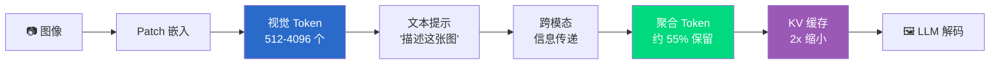

# Day 27: LightKV — 大型视觉语言模型的轻量级 KV 缓存

## TLDR

LightKV 通过跨模态信息传递，利用文本提示引导视觉token压缩，将 KV 缓存大小减少 50%，同时保持模型性能。

**标签**: KV 缓存, 多模态, 效率优化, 视觉-语言

**分类**: Work

**子分类**: inference

---

## 背景

大型视觉语言模型（LVLM），如 Qwen2-VL 和 LLaVA，在多模态理解方面表现出色，但面临一个根本性的效率瓶颈：在预填充（prefill）阶段，它们必须处理数百甚至数千个视觉token来编码单张图像。这些视觉token导致 KV 缓存急剧膨胀，消耗大量 GPU 显存并增加推理延迟。

现有的压缩方法存在以下问题：
- **统一剪枝**：无差别地删除token，导致重要视觉细节丢失
- **纯视觉压缩**：忽略引导模型的文本提示，在prompt无关区域浪费计算资源

LightKV 的核心洞察：**利用文本提示作为引导，确定哪些视觉token是重要的**。

---

## 核心问题

LVLM 推理过程中，KV 缓存的增长与以下因素成正比：

1. **视觉token数量**（每张图像通常 512-4096 个）
2. **生成文本的序列长度**
3. **模型维度**（隐藏维度 × 2 用于 K 和 V）

以 8B LVLM 为例，包含 1024 个视觉token和 512 个生成token：
- 每层 KV 缓存：约 2GB
- 32 层总计：约 64GB — 超出大多数 GPU 显存容量

---

## 方法：跨模态信息传递

LightKV 在预填充阶段添加了一个轻量级的**信息传递模块**。核心思想是通过文本嵌入的引导，将冗余的视觉token聚合到较小的信息丰富token集合中。

### 架构

```
图像 → Patch 嵌入 → [视觉 Token]
                            ↓
         ┌─ 跨模态信息传递 ─┐
         │  (文本引导聚合)  │
         └────────────────┘
                            ↓
                   [压缩后视觉 Token]
```

### 信息传递流程

1. **文本编码器**将用户提示编码为文本嵌入 $T$
2. **跨注意力聚合**：视觉token $V$  attend to 文本嵌入 $T$：

$$V' = \text{Softmax}\left(\frac{Q(V) \cdot K(T)^T}{\sqrt{d}}\right) \cdot V$$

3. **渐进式压缩**：按因子 $\tau$ 迭代减少token数量（如 $\tau = 0.55$，保留 55%）
4. **KV 缓存存储**：仅将压缩后的token $V'$ 存入 KV 缓存

### 训练目标

LightKV 冻结预训练 LVLM，仅添加轻量级辅助损失训练：

$$\mathcal{L} = \mathcal{L}_{\text{vlm}} + \lambda \cdot \mathcal{L}_{\text{compression}}$$

其中 $\mathcal{L}_{\text{compression}}$ 衡量压缩后与原始视觉表示之间的重建误差。

---

## 实验结果

在 8 个开源 LVLM 和 8 个基准数据集（MME、SeedBench 等）上评估：

| 指标 | LightKV | 基线 |
|------|---------|------|
| 保留视觉token | 55% | 100% |
| KV 缓存减少 | 2x | 0 |
| 计算量减少 | 40% | 0 |
| 精度保持 | ~100% | 100% |

压缩比例是自适应的——复杂图像保留更多token，简单图像压缩更激进。

---

## 关键洞察

### 1. 文本引导 vs 纯视觉压缩

纯视觉压缩方法对所有视觉区域一视同仁。LightKV 使用文本查询作为相关性信号：

- 查询："有多少人？" → 聚焦人物区域
- 查询："车是什么颜色？" → 聚焦车辆区域
- 查询："描述背景" → 聚焦背景区域

### 2. 距离无关检索

标准注意力随token距离衰减（长序列 → 早期token注意力弱）。LightKV 的聚合创建了**快捷路径**，直接检索视觉信息，不受序列长度影响，对抗"视觉信号稀释"问题。

### 3. 极小开销

信息传递模块相比冻结的 LVLM 主干仅增加约 0.5% 额外参数，是轻量级添加，无需重训练整个模型。

---

## Mermaid 图表



---

## 快速测验

**Q1**: LightKV 解决了 LVLM 推理中的什么主要问题？

A) 文本生成速度慢  
B) 视觉token KV 缓存导致 GPU 显存过高  
C) 视觉问答精度差  
D) 缺乏多语言支持  

<details>
<summary>答案</summary>
**B** — 视觉token主导预填充阶段的 KV 缓存显存。LightKV 通过文本引导压缩将其减少约 50%。
</details>

---

**Q2**: 是什么使 LightKV 的压缩是"提示感知的"？

A) 在看到提示前统一压缩token  
B) 使用文本嵌入引导哪些视觉token需要聚合  
C) 仅在文本生成时压缩，非预填充阶段  
D) 仅根据图像复杂度压缩  

<details>
<summary>答案</summary>
**B** — 跨模态信息传递使用文本提示嵌入来确定哪些视觉token是相关的（应保留）vs 可聚合的。
</details>

---

**Q3**: LightKV 如何实现"距离无关检索"？

A) 增加模型深度  
B) 创建绕过标准注意力衰减的快捷路径  
C) 减少层数  
D) 使用更大的上下文窗口  

<details>
<summary>答案</summary>
**B** — 聚合模块建立了直接检索路径，独立于token距离，反抗长序列下的视觉信号稀释。
</details>

---

## 代码示例

```python
import torch
import torch.nn.functional as F

class LightKVCompression(torch.nn.Module):
    def __init__(self, hidden_dim, compression_ratio=0.55):
        super().__init__()
        self.compression_ratio = compression_ratio
        self.query_proj = torch.nn.Linear(hidden_dim, hidden_dim)
        self.key_proj = torch.nn.Linear(hidden_dim, hidden_dim)
        self.value_proj = torch.nn.Linear(hidden_dim, hidden_dim)
    
    def cross_modality_aggregation(self, vision_tokens, text_embeddings):
        # Project for cross-attention
        Q = self.query_proj(vision_tokens)
        K = self.key_proj(text_embeddings)
        V = self.value_proj(text_embeddings)
        
        # Cross-attention: vision tokens attend to text
        attention = F.softmax(Q @ K.transpose(-2, -1) / (Q.size(-1) ** 0.5), dim=-1)
        context = attention @ V
        
        return context
    
    def compress(self, vision_tokens, text_tokens, num_output_tokens):
        text_emb = self.cross_modality_aggregation(vision_tokens, text_tokens)
        
        # Aggregate vision tokens guided by text
        aggregated = (vision_tokens + text_emb) / 2
        
        # Select top-k tokens as compressed representation
        k = max(1, int(len(vision_tokens) * self.compression_ratio))
        # In practice: use learned selection or pooling
        return aggregated[:num_output_tokens]
```

---

## 结论

LightKV 表明**文本引导压缩**优于纯视觉方法，通过选择性地保留与用户查询相关的token。关键创新：

1. 跨模态信息传递（文本 → 视觉相关性信号）
2. 渐进式token减少，最小化信息丢失
3. 距离无关检索路径

随着 LVLM 扩展到更长的上下文和更高分辨率图像，类似 LightKV 的压缩技术对于实际部署变得必不可少。

---

## 延伸阅读

- [LightKV 论文](https://arxiv.org/abs/2605.00789) (arXiv:2605.00789)
- [Qwen2-VL](https://arxiv.org/abs/2605.00789) — LightKV 评估的强基线 LVLM
- [LLaVA](https://arxiv.org/abs/2304.08485) — 早期 LVLM，展示视觉token扩展问题
