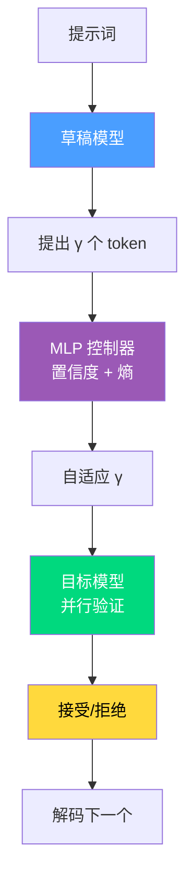

# Day 28: SpecKV — 自适应推测解码：基于压缩感知 Gamma 选择的动态推测长度

## TLDR

SpecKV 用自适应 MLP 控制器替代固定的推测长度（γ=4），根据草稿模型的置信度和熵信号选择每步的最优 γ，在 <0.5% 开销下实现相比固定基线 56% 的性能提升。

**标签**: 推测解码, 推理优化, 自适应采样, LLM

**分类**: Work

**子分类**: inference

---

## 背景

推测解码通过使用小型**草稿模型**提出候选token，大型**目标模型**并行验证来加速 LLM 推理。关键超参数是**推测长度 γ**——草稿模型每步提出多少个 token。

当前系统普遍使用**固定 γ=4**。但问题在于：最优 γ 在以下情况下差异巨大：
- **任务类型**（代码生成 vs 对话 vs 推理）
- **压缩级别**（FP16 vs INT8 vs NF4 量化）
- **草稿置信度**（高熵 → 低接受率，小 γ 更好）

SpecKV 的洞察：**γ 应该根据草稿模型已产生的信号进行自适应调整**。

---

## 核心问题

固定推测长度造成权衡困境：

| γ 值 | 最优场景 | 最差场景 |
|------|---------|---------|
| 小 (1-2) | 草稿置信度低，早期生成 | 高接受率时浪费潜力 |
| 大 (5-8) | 草稿置信度高，后期生成 | 低接受率时浪费验证计算 |

使用固定 γ=4，你要么：
- **推测不足** → 草稿自信时，性能未充分发挥
- **推测过度** → 草稿不自信时，浪费目标模型调用在将被拒绝的 token 上

SpecKV 通过**轻量级 MLP 控制器**解决此问题，预测每步的最优 γ。

---

## 方法：自适应 Gamma 选择

### 推测流水线

```
草稿模型 → 提出 γ 个 token → 目标模型 → 并行验证
                ↑                          ↓
          MLP 控制器                  接受/拒绝
        (置信度 + 熵)                  决策
```

### SpecKV 控制器

MLP 接收每步信号并输出最优 γ：

**输入特征**：
- **草稿置信度**：下一个 token 预测的最大概率
- **草稿熵**：token 分布的不确定性度量
- **序列位置**：早期 vs 后期生成阶段
- **上下文特征**：压缩级别（FP16/INT8/NF4）

**训练数据**：跨 4 个任务类别、4 个推测长度（γ ∈ {2, 4, 6, 8}）、3 个压缩级别收集的 5,112 条步级记录

**相关性**：草稿置信度/熵 → 接受率 ≈ 0.56

### 数学表述

每步推测的期望 token 数：

$$\mathbb{E}[\text{tokens}] = \gamma \cdot P(\text{accept} | \gamma, \mathbf{s})$$

其中 $\mathbf{s}$ = 草稿模型信号。SpecKV 的 MLP 使其最大化：

$$\hat{\gamma} = \arg\max_\gamma \gamma \cdot P(\text{accept} | \gamma, \mathbf{s})$$

### 开销

- MLP 推理：每决策 **0.34ms**
- 占步时间比：**<0.5%**
- 模型大小：可忽略（数千参数）

---

## 实验结果

在 Spider2-Snow 上使用 gpt-oss-120b：

| 配置 | 接受率 | 加速比 |
|------|--------|--------|
| 固定 γ=4（基线） | ~50% | 1.0x |
| 固定 γ=6 | ~45% | 0.9x |
| 固定 γ=2 | ~70% | 0.85x |
| **SpecKV（自适应）** | **~78%** | **1.56x** |

关键发现：
- 相比固定 γ=4 基线**提升 56%**（p < 0.001）
- 最优 γ 随压缩级别变化（NF4 → 更低 γ 最优）
- 控制器泛化到训练未见过的任务类型

---

## 关键洞察

### 1. 草稿模型具有自我诊断能力

草稿模型已经"知道"自己何时不确定——这表现为：
- 低置信度（最大 token 概率接近均匀分布）
- 高熵（top-k token 上的平坦分布）

SpecKV 提取这些信号并利用它们，而非将草稿视为黑箱。

### 2. 压缩级别影响最优 γ

不同压缩级别改变目标模型的接受行为：

| 压缩 | 最优 γ | 原因 |
|------|--------|------|
| FP16 | 4-6 | 高保真，可验证更多 |
| INT8 | 3-5 | 轻微量化噪声 |
| NF4 | 2-4 | 更高拒绝率，更小的 γ 更安全 |

### 3. 轻量级适配

MLP 控制器几乎不增加延迟。它在 profiling 数据上训练一次，然后部署为固定模块——无在线学习开销。

---

## Mermaid 图表



---

## 快速测验

**Q1**: SpecKV 的 MLP 控制器预测什么？

A) 是否使用草稿模型或目标模型  
B) 每步的最优推测长度 γ  
C) 目标模型的接受概率  
D) 目标模型的熵  

<details>
<summary>答案</summary>
**B** — MLP 以草稿置信度和熵为输入，输出每步的最优 γ（1-8 个 token）。
</details>

---

**Q2**: 为什么 SpecKV 比固定 γ=4 获得更高的接受率？

A) 它使用更大的草稿模型  
B) 它使用更强的目标模型  
C) 它根据草稿置信度调整 γ — 低置信度 → 小 γ，高置信度 → 大 γ  
D) 它跳过验证步骤  

<details>
<summary>答案</summary>
**C** — 当草稿模型不确定（低置信度）时，SpecKV 选择更小的 γ 以避免在将被拒绝的 token 上浪费计算。当自信时，提出更多 token。
</details>

---

**Q3**: SpecKV 的 MLP 控制器的开销是多少？

A) 每决策 10-20ms  
B) 每决策 5-10ms  
C) 每决策 0.34ms（占步时间 <0.5%）  
D) 无开销——免费的  

<details>
<summary>答案</summary>
**C** — 每决策 0.34ms 开销，只占步时间的 0.5% 以下，使自适应调整几乎免费。
</details>

---

## 代码示例

```python
import torch
import torch.nn as nn

class SpecKVController(nn.Module):
    """自适应 gamma 选择的 MLP 控制器。"""
    def __init__(self, input_dim=4, hidden_dim=16, output_dim=7):
        super().__init__()
        self.mlp = nn.Sequential(
            nn.Linear(input_dim, hidden_dim),
            nn.ReLU(),
            nn.Linear(hidden_dim, hidden_dim),
            nn.ReLU(),
            nn.Linear(hidden_dim, output_dim)  # 输出 γ ∈ {1, 2, ..., 7} 的 logit
        )
    
    def forward(self, confidence, entropy, position, compression_level):
        """
        参数:
            confidence: 草稿模型的最大 token 概率 [batch]
            entropy: 草稿模型 token 分布熵 [batch]
            position: 序列中的位置（归一化）[batch]
            compression_level: 0=FP16, 1=INT8, 2=NF4 [batch]
        返回:
            gamma: 每个样本的最优推测长度 [batch]
        """
        x = torch.stack([confidence, entropy, position, compression_level], dim=-1)
        logits = self.mlp(x)
        return logits.argmax(dim=-1) + 1  # γ ∈ {1, ..., 7}
    
    def get_expected_tokens(self, gamma, acceptance_rate):
        """每步推测的期望 token 数。"""
        return gamma * acceptance_rate


def select_adaptive_gamma(controller, draft_model, draft_logits, compression_level):
    """使用 SpecKV 控制器为每个样本选择 gamma。"""
    probs = torch.softmax(draft_logits, dim=-1)
    confidence = probs.max(dim=-1).values  # 最大 token 概率
    entropy = -(probs * torch.log(probs + 1e-8)).sum(dim=-1)  # 熵
    
    position = torch.arange(len(probs)).float() / 1000.0  # 归一化
    
    gamma = controller(confidence, entropy, position, compression_level)
    return gamma
```

---

## 结论

SpecKV 表明**自适应超参数选择**在推测解码中优于静态配置。关键创新：

1. **自监督信号提取** — 利用草稿模型置信度/熵预测接受率
2. **步级自适应** — 不同推测步使用不同 γ
3. **压缩感知** — 考虑量化级别的 γ 选择
4. **极小开销** — 仅 0.34ms MLP 推理即可带来显著加速

随着 LLM 变得更加量化并部署在多样化硬件上，像 SpecKV 这样的自适应技术对于最大化推理效率至关重要。

---

## 延伸阅读

- [SpecKV 论文](https://arxiv.org/abs/2605.02888) (arXiv:2605.02888)
- [SpecTriver](https://arxiv.org/abs/2604.07499) — Day 20 的早期推测解码工作
- [LightKV](/tutorials/zh/work/inference/27-lightkv.md) — Day 27 的 KV 缓存压缩（与 SpecKV 互补）
- [PRISM](/tutorials/zh/work/inference/26-prism.md) — Day 26 的推测解码在线策略蒸馏