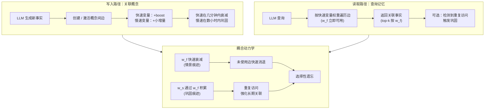

# Day 30: Memini -- 多尺度记忆动力学让大模型持续更新知识

> **观看动画**: 

## 一句话总结

Memini 将 LLM 外部记忆重新定义为一个关联有向图，每条边携带两个耦合变量（快速变量 + 慢速变量），灵感来自 Benna-Fusi 突触巩固模型——由此从单一机制涌现出情景敏感性（新知识即时可用）、渐进巩固（重复确认强化长期记忆）和选择性遗忘（未使用边逐渐消退）三大特性。

---

## 为什么重要

### 静态大模型的问题

大语言模型在固定数据集上训练一次，然后就部署到一个不断变化的世界中。模型权重是冻结的；不经过昂贵的重训练或微调，它们无法原生更新事实知识。

标准解决方案是**外部记忆**——一个独立的存储系统（向量数据库、知识图谱、检索索引），LLM 在推理时查询它。但现有方法将记忆视为被动查表：存储事实，检索，结束。

**生物学的悖论**：生物记忆并非如此工作。你的大脑不会在固定位置存储记忆——它根据记忆被使用的频率、最近时间和上下文动态调整连接的强度。

### Memini 的贡献

Memini 提出：外部记忆本身应该是一个**学习系统**，而不仅仅是存储系统。知识应该通过自身的动力学重组：

- 新关联立即可用（情景敏感性）
- 重复确认随时间强化记忆（渐进巩固）
- 很少使用的知识逐渐消失（选择性遗忘）

这三个特性都从同一个原则性机制涌现：**记忆图上耦合的多尺度动力学**。

---

## 架构详解

### 核心数据结构：关联图

Memini 将外部知识组织为一个**有向图**：

```
节点 = 概念 / 实体
边 = 概念之间的关联
边权重 = 两个耦合变量（快速、慢速）
```

当 LLM 从记忆中读取时，它按**快速变量**加权的边遍历。当它写入记忆时，快速和慢速变量都会更新。慢速变量携带巩固后的长期痕迹。

### Benna-Fusi 快慢耦合更新规则

每条边的更新规则遵循 Benna-Fusi 突触巩固模型：

$$
w_f^{(t+1)} = w_f^{(t)} \cdot \alpha_f + \eta_f \cdot \delta
$$
$$
w_s^{(t+1)} = w_s^{(t)} \cdot \alpha_s + \eta_s \cdot \delta \cdot w_f^{(t)}
$$

其中：
- $w_f$ = 快速变量（即时，衰减快）
- $w_s$ = 慢速变量（渐进，衰减慢）
- $\alpha_f > \alpha_s$（快速衰减更快）
- $\eta_f, \eta_s$ = 学习率
- $\delta$ = 预测误差 / 强化信号

**关键洞察**：慢速变量依赖于快速变量，因此新关联立即可用（高 $w_f$），但仅逐步巩固（$w_s$ 缓慢增长）。

### 记忆操作



### 涌现特性

**情景敏感性**：创建新边时，$w_f$ 立即飙升。LLM 在下一次查询时就能检索到这个关联——无需"训练"延迟。

**渐进巩固**：每次激活同一路径时，$w_f$ 短暂再次上升，向 $w_s$ 贡献一个小的增量。即使访问之间 $w_f$ 已衰减，$w_s$ 仍会累积。该关联变得稳健。

**选择性遗忘**：如果某条边再也没有被访问，$w_f$ 迅速衰减至零。慢速变量也会衰减，但速度慢得多。实际上，这意味着：最近学习但未使用的事实快速消退；巩固良好的事实在更长时间内保持。

---

## 核心结果

来自论文（Memini, 2026）：

| 特性 | 机制 | 行为结果 |
|:-----|:-----|:---------|
| 情景敏感性 | 写入时 $w_f$ 高 | 新知识立即可用 |
| 渐进巩固 | 重复 $w_f$ 峰值累积 $w_s$ | 重复访问强化事实 |
| 选择性遗忘 | $w_f$ 快衰减，$w_s$ 慢衰减 | 稀有事实消退，核心事实持久 |
| 单一机制 | Benna-Fusi 耦合更新 | 三者来自同一公式 |

---

## 这使得什么成为可能

**无需重训练的持续知识更新**：可以通过激活对应边来更新事实——无需梯度计算，无需触碰模型权重。

**上下文感知记忆优先级**：在当前对话中频繁访问的概念自然强化其边，使记忆响应相关性。

**优雅降级**：随着旧事实消退，系统不会突然截止——最近的事实较弱但仍可检索；只有真正被遗弃的事实才会完全消失。

---

## 快速测验

**Q1**: 在 Benna-Fusi 更新规则中，慢速变量 $w_s$ 依赖于而快速变量 $w_f$ 不依赖的是什么？

**Q2**: 如果一条边被激活一次后再也没有被访问，哪个特性描述了它为何从记忆中消退？

**Q3**: Memini 的记忆是一个*关联图*，而非简单的键值存储。图结构相比扁平键值查找有什么优势？

---

## 相关阅读

- [Day 08: Memory & KV Cache](/tutorials/zh/work/memory/08-memory-kv-cache.md) — PagedAttention 与 GPU 内存淘汰策略
- [Day 27: LightKV](/tutorials/zh/work/inference/27-lightkv.md) — 面向多模态大语言模型的轻量级 KV 缓存压缩

---

## 参考文献

- Pattichis & Dovrolis, "[Continual Knowledge Updating in LLM Systems: Learning Through Multi-Timescale Memory Dynamics](https://arxiv.org/abs/2605.05097)", arXiv 2605.05097 (2026)
